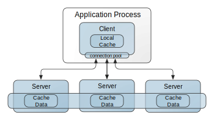
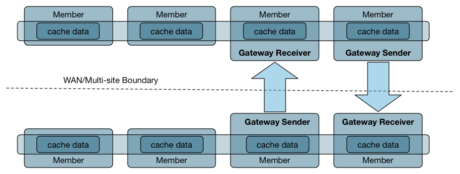
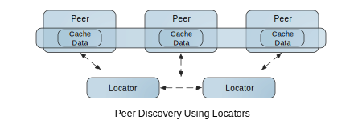
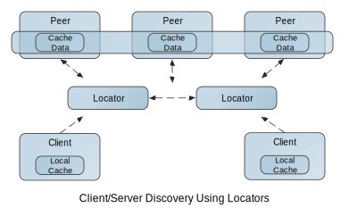

# 拓扑和通信

*拓扑和通信* 解释了如何规划和配置Apache Geode成员发现，对等和客户端/服务器通信拓扑。


- **[拓扑和通信一般概念](#拓扑和通信一般概念)**

  在配置Apache Geode成员之前，请确保了解拓扑和通信的选项。

- **[点对点配置](#点对点配置)**

  使用对等配置在单个集群中设置成员发现和通信。

- **[客户端/服务器配置](#客户端/服务器配置)**

  在客户端/服务器体系结构中，相对较小的服务器场管理许多客户端应用程序的缓存数据和访问相同数据。 客户端可以有效地更新和访问数据，使服务器管理向其他客户端的数据分发以及与外部数据存储的任何同步。

- **[多站点(WAN)配置](#多站点(WAN)配置)**

  使用多站点配置在不同的，松散耦合的集群之间水平扩展。 广域网(WAN)是多站点拓扑的主要用例。


## 拓扑和通信一般概念

在配置Apache Geode成员之前，请确保了解拓扑和通信的选项。

- **拓扑类型**

  Apache Geode拓扑选项允许您水平和垂直缩放。

- **规划拓扑和通信**

  创建拓扑计划以及成员将使用的计算机和通信端口的详细列表。 配置Apache Geode系统以及系统之间的通信。

- **成员发现如何运作**

  Apache Geode为集群内以及客户端和服务器之间的成员发现提供了各种选项。

- **沟通如何运作**

  Geode使用TCP和UDP单播和多播的组合来进行成员之间的通信。 您可以更改默认行为以优化系统通信。

- **使用绑定地址**

  您使用绑定地址配置通过非默认网卡发送网络流量，并在多个卡上分配Geode的网络流量负载。 如果未找到绑定地址设置，Geode将使用主机的默认地址。

- **在IPv4和IPv6之间进行选择**

  默认情况下，Apache Geode将Internet协议版本4用于Geode地址规范。 如果所有计算机都支持Internet协议，则可以切换到Internet协议版本6。 您可能会失去性能，因此您需要了解进行切换的成本。


### 拓扑类型

Apache Geode拓扑选项允许您水平和垂直缩放。

Apache Geode提供各种缓存拓扑：

- 所有系统的核心是单个对等集群。
- 对于水平和垂直扩展，您可以将各个系统组合到客户端/服务器和多站点(WAN)拓扑中：
  - 在客户端/服务器系统中，少数服务器进程管理更大的客户端组的数据和事件处理。
  - 在多站点系统中，几个地理上不同的系统松散地耦合到单个，内聚的处理单元中。

**点对点配置**

对等集群是所有Geode安装的构建块。 单独对等是最简单的拓扑。 每个缓存实例或成员直接与集群中的每个其他成员通信。 此缓存配置主要是为需要在应用程序进程空间中嵌入缓存并参与集群的应用程序而设计的。 典型示例是应用程序服务器集群，其中应用程序和缓存位于同一位并共享同一堆。


**客户端/服务器配置**

客户端/服务器拓扑是垂直扩展的模型，其中客户端通常在应用程序进程空间中托管一小部分数据，并为其余部分委托给服务器系统。 与点对点本身相比，客户端/服务器架构提供了更好的数据隔离，高获取性能和更高的可扩展性。 如果数据分发会给网络带来非常沉重的负担，那么客户端/服务器架构通常会提供更好的性能。 在任何客户端/服务器安装中，服务器系统本身是对等系统，数据在服务器之间分配。 客户端系统具有连接池，用于与服务器和其他Geode成员通信。 客户端还可以包含本地缓存。



**多站点配置**

对于水平扩展，您可以使用松散耦合的多站点拓扑。 对于多站点，多个Geode系统松散耦合，通常跨越地理距离，连接速度较慢，例如WAN。 此拓扑提供了比单个系统的紧密耦合更好的性能，以及位置之间更大的独立性，因此如果连接或远程站点不可用，每个站点都可以自行运行。 在多站点安装中，每个站点都是对等或客户端/服务器系统。



### 规划拓扑和通信

创建拓扑计划以及成员将使用的计算机和通信端口的详细列表。 配置Apache Geode系统以及系统之间的通信。

**确定协议和地址**

您的配置管理应用程序如何相互查找以及相互之间分发事件和数据。

与系统管理员一起确定将用于成员身份和通信的协议和地址。

1. 对于具有多个网络适配卡的每台主机，请确定是使用默认地址还是使用一个或多个非默认绑定地址。 您可以为对等和服务器使用不同的卡。
2. 确定您想要作为独立，孤立的成员运行而没有成员发现的任何成员。 对于客户来说，这可能是一个不错的选择，因为它具有更快的启动速度，但没有任何类型的点对点分发。
3. 对于所有非独立成员：
   - 确定要使用的定位器数量以及运行位置。 要确保最稳定的启动和可用性，请在多台计算机上使用多个定位器。
   - 创建定位器的地址和端口对列表。 您将使用该列表配置系统成员，任何客户端和定位器本身。
   - 如果要使用多播进行通信，请记下地址和端口。 为集群选择唯一的多播端口和唯一地址。 **注意:**即使您使用不同的多播地址，也请为不同的系统使用不同的端口号。 某些操作系统不会在具有唯一地址但具有相同端口号的系统之间保持通信分离。

**设置好成员和通讯**

使用上面确定的协议和地址，执行以下操作：

- 在您的系统中设置成员身份。
- 建立系统成员之间的通信。 请参阅[配置对等通信](http://geode.apache.org/docs/guide/17/topologies_and_comm/p2p_configuration/setting_up_peer_communication.html)。
- 根据需要，在系统之间建立通信。 请参阅[配置客户端/服务器系统](http://geode.apache.org/docs/guide/17/topologies_and_comm/cs_configuration/setting_up_a_client_server_system.html#setting_up_a_client_server_system)。


### 成员发现如何运作

Apache Geode为集群内以及客户端和服务器之间的成员发现提供了各种选项。

- [对等成员发现](http://geode.apache.org/docs/guide/17/topologies_and_comm/topology_concepts/how_member_discovery_works.html#how_member_discovery_works__section_F2B8EBF2909440BD90B4CDEE0CAA0C2A)
- [独立成员](http://geode.apache.org/docs/guide/17/topologies_and_comm/topology_concepts/how_member_discovery_works.html#how_member_discovery_works__section_E26DFAFE9E994C0C9A489E325E345816)
- [客户端发现服务器](http://geode.apache.org/docs/guide/17/topologies_and_comm/topology_concepts/how_member_discovery_works.html#how_member_discovery_works__section_37DE53BDCDB541618C6DF4E47A1F2B73)

**对等成员发现**

对等成员发现是定义集群的原因。 使用相同设置进行对等发现的所有应用程序和缓存服务器都是同一集群的成员。 每个系统成员都具有唯一的身份，并且知道其他成员的身份。 成员一次只能属于一个集群。 一旦他们找到对方，成员就会直接进行通信，而不依赖于发现机制。 在对等点发现中，Geode使用成员协调器来管理成员加入和离开。

成员使用一个或多个定位器发现彼此。 定位器提供发现和负载平衡服务。 对等定位器管理集群成员的动态列表。 新成员连接到其中一个定位器以检索用于加入系统的成员列表。



**注意:** 多个定位器可确保集群的最稳定启动和可用性。

**独立成员**

独立成员没有对等体，没有对等体发现，因此不使用定位器。 它仅创建集群连接以访问Geode缓存功能。 独立运行具有更快的启动速度，适用于与其他应用程序隔离的任何成员。 主要用例是客户端应用程序。 如果您允许该成员成为JMX Manager，则可以访问和监视独立成员。

**客户端发现服务器**

定位器为客户端提供动态服务器发现和服务器负载平衡。 客户端配置有服务器系统的定位器信息，并转向定位器以获取要使用的服务器的指示。 服务器可以来去，它们为新客户端连接提供服务的能力可能会有所不同。 定位器持续监控服务器可用性和服务器负载信息，随时为客户端提供负载最小的服务器的连接信息。

**注意:** 对于性能和高速缓存一致性，客户端必须作为独立成员运行，或者在与其服务器不同的集群中运行。

您无需运行任何特殊进程即可使用定位器进行服务器发现。 在服务器系统中提供对等点发现的定位器还为客户端向服务器系统提供服务器发现。 这是标准配置。



**多站点发现**

在多站点(WAN)配置中，Geode集群使用定位器来发现远程Geode集群以及发现本地Geode成员。 WAN配置中的每个定位器唯一标识它所属的本地集群，还可以识别它将连接到WAN分发的远程Geode集群中的定位器。

当定位器启动时，它会联系每个远程定位器，以交换有关远程集群中可用定位器和网关接收器配置的信息。 除了共享有关其自己的集群的信息之外，定位器还共享从所有其他连接集群获取的信息。 每次新定位器启动或现有定位器关闭时，更改的信息都会通过WAN广播到其他连接的Geode集群。

有关详细信息，请参阅[多站点系统发现](http://geode.apache.org/docs/guide/17/topologies_and_comm/topology_concepts/multisite_overview.html#topic_1742957C8D4B4F7590847EB8DB6CD4F7)。

### 通信如何工作

Geode使用TCP和UDP单播和多播的组合来进行成员之间的通信。 您可以更改默认行为以优化系统通信。

客户端/服务器通信和网关发送器与网关接收器通信使用TCP/IP套接字。 服务器侦听已发布地址的客户端通信，客户端建立连接，发送其位置。 类似地，网关接收器侦听网关发送器通信，并在站点之间建立连接。

在对等系统中，对于一般消息传递和区域操作分发，Geode使用TCP或UDP单播。 默认值为TCP。 您可以对所有通信使用TCP或UDP单播，也可以将其用作默认通信，但可以将特定区域作为目标，以使用UDP多播进行操作分发。 安装的最佳组合在很大程度上取决于您的数据使用和事件消息传递。

**TCP**

TCP（传输控制协议）提供系统消息的可靠有序传送。 如果数据是分区的，如果集群很小，或者网络负载是不可预测的，则TCP比UDP更合适。 TCP优于较小集群中的UDP单播，因为它在操作系统级别实现比UDP更可靠的通信，并且其性能可以比UDP快得多。 然而，随着集群规模的增加，UDP的相对较小的开销使其成为更好的选择。 TCP为每个成员添加了新的线程和套接字，随着系统的增长导致更多的开销。

**注意:** 即使Geode配置为使用UDP进行消息传递，Geode在尝试检测失败的成员时也会使用TCP连接。 有关详细信息，请参阅[故障检测和成员资格视图](http://geode.apache.org/docs/guide/17/managing/network_partitioning/failure_detection.html#concept_CFD13177F78C456095622151D6EE10EB)。 此外，TCP连接的ping不用于保持活动目的; 它仅用于检测失败的成员。 有关TCP保持活动配置，请参阅[TCP/IP KeepAlive配置](http://geode.apache.org/docs/guide/17/managing/monitor_tune/socket_tcp_keepalive.html#topic_jvc_pw3_34)。

**UDP单播和多播**

UDP（用户数据报协议）是一种无连接协议，它使用的资源远少于TCP。 向集群添加另一个进程会导致UDP消息传递的开销很小。 然而，UDP本身并不可靠，并且消息的大小限制为64k字节或更少，包括消息头的开销。 大型消息必须分段并作为多个数据报消息传输。 因此，在许多情况下UDP比TCP慢，而在其他情况下如果网络流量不可预测或严重拥塞则不可用。

UDP在Geode中用于单播和多播消息传递。 Geode实现重传协议以确保通过UDP正确传递消息。

**UDP单播**

UDP单播是用于一般消息传递的TCP的替代方案。 当集群中有大量进程，网络不拥塞，缓存对象很小，并且应用程序可以为缓存提供足够的处理时间来从网络读取时，UDP比TCP更适合单播消息传递。 如果禁用TCP，Geode将使用UDP进行单播消息传递。

对于每个成员，Geode为UDP单播通信选择一个唯一的端口。 您可以通过在`gemfire.properties`文件中设置`membership -port-range`来限制用于选择的范围。 例：

```
membership-port-range=1024-60000
```

**注意:**除UDP端口配置外，`membership-port-range`属性还定义了用于故障检测的TCP端口。 有关Geode属性的说明，请参阅[参考](http://geode.apache.org/docs/guide/17/reference/book_intro.html#reference)。

**UDP多播**

常规消息传递和默认区域操作消息传递的选项是TCP和UDP单播之间。 您可以选择使用UDP多播替换默认值，以用于部分或全部区域的操作分发。 对于要使用多播的每个区域，您可以在区域本身上设置其他属性。

为区域启用多播时，集群中的所有进程都将接收该区域的所有事件。 每个成员都会收到该区域的每条消息，并且必须将其解压缩，安排进行处理，然后进行处理，所有这些都在发现它是否对消息感兴趣之前。 因此，多播适用于集群中普遍感兴趣的区域，其中大多数或所有成员具有定义的区域并且有兴趣接收该区域的大多数或所有消息。 多播不应该用于集群中一般不太感兴趣的区域。

当集群中的大多数进程使用相同的缓存区域并且需要为它们获取更新时，例如当进程定义复制区域或将其区域配置为接收所有事件时，多播是最合适的。

即使您对区域使用多播，Geode也会在适当时发送单播消息。 如果数据被分区，则多播不是一个有用的选项。 即使启用了多播，分区区域仍然几乎用于所有目的的单播。


### 使用绑定地址

您可以使用绑定地址配置通过非默认网卡发送网络流量，并在多个卡上分配Geode的网络流量负载。 如果未找到绑定地址设置，Geode将使用主机的默认地址。

主机将数据传输到网络并通过一个或多个网卡（也称为网络接口卡（NIC）或LAN卡）从网络接收数据。 具有多个卡的主机称为多宿主主机。 在多宿主主机上，默认使用一个网卡。 您可以使用绑定地址将Geode成员配置为在多宿主主机上使用非默认网卡。

**注意:** 为进程指定非默认卡地址时，连接到该进程的所有进程都需要在其连接设置中使用相同的地址。 例如，如果对服务器定位器使用绑定地址，则必须使用相同的地址来配置客户端中的服务器池。

使用IPv4或IPv6数字地址规范进行绑定地址设置。 有关这些规范的信息，请参阅[在IPv4和IPv6之间选择](http://geode.apache.org/docs/guide/17/topologies_and_comm/topology_concepts/IPv4_and_IPv6.html)。 不要使用主机名作为地址规范。 主机名解析为默认计算机地址。

**对等和服务器通信**

您可以配置对等和服务器通信，以便每种通信类型使用自己的地址或类型使用相同的地址。 如果未找到特定通信类型的设置，Geode将使用主机的默认地址。

**注意:** 通过API设置的绑定地址（如“CacheServer”和“DistributedSystem”）优先于此处讨论的设置。 如果您的设置不起作用，请检查以确保没有通过API调用完成绑定地址设置。

此表列出了用于对等和服务器通信的设置，按优先级排序。 例如，对于服务器通信，Geode首先搜索缓存服务器绑定地址，然后搜索`gfsh start server``server-bind-address`设置，依此类推，直到找到设置或所有可能性都用完为止。

| Property Setting Ordered by Precedence              | Peer | Server | Gateway Receiver | Syntax                                           |
| --------------------------------------------------- | ---- | ------ | ---------------- | ------------------------------------------------ |
| cache.xml <cache-server> bind-address               |      | X      |                  | <cache-server>bind-address=*address*             |
| gfsh start server command-line –server-bind-address |      | X      | X                | gfsh start server –server-bind-address=*address* |
| gemfire.properties server-bind-address              |      | X      | X                | server-bind-address=*address*                    |
| gemfire.properties bind-address                     | X    | X      | X                | bind-address=*address*                           |

例如，在gemfire.properties和cache.xml文件中使用这些配置启动的成员将使用两个单独的地址进行对等和服务器通信：

```xml
// gemfire.properties setting for peer communication
bind-address=192.0.2.0
//cache.xml settings
<cache>

// Server communication
  <cache-server bind-address="192.0.2.1" ...

  <region ...
```

**网关接收器通信**

如果使用多站点（WAN）拓扑，还可以配置网关接收器通信（除了对等和服务器通信），以便每种通信类型使用自己的地址。

此表列出了用于对等，服务器和网关接收器通信的设置，按优先级排序。 例如，对于网关接收器通信，Geode首先搜索`cache.xml` ` <gateway-receiver>` `bind-address`设置。 如果没有设置，Geode将搜索`gfsh start server` `server-bind-address`设置，依此类推，直到找到设置或所有可能性都用完为止。

| Property Setting Ordered by Precedence              | Peer | Server | Gateway Receiver | Syntax                                           |
| --------------------------------------------------- | ---- | ------ | ---------------- | ------------------------------------------------ |
| cache.xml <gateway-receiver> bind-address           |      |        | X                | <gateway-receiver>bind-address=*address*         |
| cache.xml <cache-server> bind-address               |      | X      |                  | <cache-server>bind-address=*address*             |
| gfsh start server command-line –server-bind-address |      | X      | X                | gfsh start server –server-bind-address=*address* |
| gemfire.properties server-bind-address              |      | X      | X                | server-bind-address=*address*                    |
| gemfire.properties bind-address                     | X    | X      | X                | bind-address=*address*                           |

例如，在`gemfire.properties`和`cache.xml`文件中以这些配置开头的成员将使用三个单独的地址进行对等，服务器和网关接收器通信：

```xml
// gemfire.properties setting for peer communication
bind-address=192.0.2.0
//cache.xml settings
<cache>
// Gateway receiver configuration
  <gateway-receiver start-port="1530" end-port="1551" bind-address="192.0.2.2"/>

// Server communication
  <cache-server bind-address="192.0.2.1" ...

  <region ...
```

**定位器通信**

使用以下方法之一设置定位器绑定地址：

- 在`gfsh`命令行上，在启动定位器时指定绑定地址，与指定任何其他地址相同：

  ```
  gfsh>start locator --name=my_locator --bind-address=ip-address-to-bind --port=portNumber
  ```

- 在Geode应用程序中，执行以下操作之一：

  - 使用gemfire属性`start-locator`自动启动共址定位器，并在该属性设置中为其指定绑定地址。
  - 使用`org.apache.geode.distributed.LocatorLauncher` API启动代码中的定位器。 使用`LocatorLauncher.Builder`类构造`LocatorLauncher`的实例，使用`setBindAddress`方法指定要使用的IP地址，然后使用start()方法启动嵌入在Java应用程序进程中的Locator服务。

如果您的定位器使用绑定地址，请确保访问定位器的每个进程都具有该地址。 对于定位器的对等访问，请使用定位器的绑定地址和`gemfire.properties` `locators`列表中的定位器端口。 对于客户端/服务器安装中的服务器发现，请在客户端的服务器池配置中使用定位器的绑定地址和您提供的定位器列表中的定位器端口。

### 在IPv4和IPv6之间进行选择

默认情况下，Apache Geode将Internet协议版本4用于Geode地址规范。 如果所有计算机都支持Internet协议，则可以切换到Internet协议版本6。 您可能会失去性能，因此您需要了解进行切换的成本。

- IPv4使用32位地址。 IPv4是第一个协议，仍然是主要使用的协议，但其地址空间预计将在几年内耗尽。
- IPv6使用128位地址。 IPv6接替IPv4，并将提供更多的地址。

根据当前使用Geode的测试，通常建议使用IPv4。 IPv6连接往往需要更长的时间才能形成，并且通信往往更慢。 并非所有机器都支持IPv6寻址。 要使用IPv6，分布式系统中的所有计算机都必须支持它，否则您将遇到连接问题。

**注意:** 不要混用IPv4和IPv6地址。 全面使用其中一个。

IPv4是默认版本。

要使用IPv6，请将Java属性`java.net.preferIPv6Addresses`设置为`true`。

这些示例显示了用于在Geode中指定地址的格式。

- IPv4:

  ```
  192.0.2.0
  ```

- IPv6:

  ```
  2001:db8:85a3:0:0:8a2e:370:7334
  ```


## 点对点配置

使用对等配置在单个集群中设置成员发现和通信。

- **配置Peer-to-Peer(点对点)发现**

  同行成员使用一个或多个定位器发现彼此。

- **配置对等通信**

  默认情况下，Apache Geode使用TCP在单个集群的成员之间进行通信。 您可以在成员和区域级别修改它。

- **将Peers(同行)组织成逻辑成员组**

  在对等配置中，您可以将成员组织为逻辑成员组，并使用这些组关联特定数据或将任务分配给预定义的成员集。


### 配置Peer-to-Peer(点对点)发现

同行成员使用一个或多个定位器发现彼此。

`gemfire.properties`文件可以列出定位器：

```
locators=<locator1-address>[<port1>],<locator2-address>[<port2>]
```

要运行独立成员，`gemfire.properties`文件禁用使用定位器：

```
locators=
mcast-address=                    
mcast-port=0
```

**注意:** 定位器设置必须在整个集群中保持一致。


### 配置对等通信

默认情况下，Apache Geode使用TCP在单个分布式系统的成员之间进行通信。 您可以在成员和区域级别修改它。

在开始之前，您应该已经确定了多播的地址和端口设置，包括任何绑定地址。 请参阅[拓扑和通信一般概念](http://geode.apache.org/docs/guide/17/topologies_and_comm/topology_concepts/chapter_overview.html)。

请参阅[参考](http://geode.apache.org/docs/guide/17/reference/book_intro.html#reference)。

1. **配置常规消息传递以使用TCP或UDP单播**.

   TCP是通信的默认协议。 要使用它，只需确保在`gemfire.properties`中没有禁用它。 要么没有'disable-tcp`条目，要么有这个条目：

   ```
   disable-tcp=false
   ```

   要将UDP单播用于常规消息传递，请将此条目添加到`gemfire.properties`：

   ```
   disable-tcp=true
   ```

   `disable-tcp`设置对TCP定位器的使用或用于检测失败成员的TCP连接没有影响。

2. **使用UDP多播配置要分发的任何区域**.

   1. 为区域消息传递配置UDP多播，在`gemfire.properties`中设置非默认多播地址和端口选择：

      ```
      mcast-address=<address>
      mcast-port=<port>
      ```

   2. 在`cache.xml`中，为需要多播消息传递的每个区域启用多播：

      ```
      <region-attributes multicast-enabled="true"/> 
      ```

      **注意:** 配置不当可能会影响生产系统。 如果您打算在共享网络上使用多播，请在项目的规划阶段与网络管理员和系统管理员一起使用。 此外，您可能需要解决Geode，操作系统和网络级别的相关设置和调优问题。

一旦您的成员建立了彼此的连接，他们将根据您的配置发送分布式数据和消息。

### 将Peer(同行)组织成逻辑成员组

在对等配置中，您可以将成员组织为逻辑成员组，并使用这些组关联特定数据或将任务分配给预定义的成员集。

您可以使用逻辑成员组跨多个成员部署JAR应用程序，或跨成员组执行功能。

要将对等体添加到成员组，您可以配置以下内容：

1. 将成员组名称添加到成员的`gemfire.properties`文件中。 例如：

   ```
   #gemfire.properties
   groups=Portfolios,ManagementGroup1
   ```

   成员可以属于多个成员组。 如果为成员指定多个成员组，请使用逗号分隔列表。 或者，如果您使用`gfsh`命令接口来启动成员，请提供组名称或组名称作为参数。

   例如，要启动服务器并将其与成员组关联，可以键入：

   ```
   gfsh>start server --name=server1 \
   --group=Portfolios,ManagementGroup1
   ```

   例如，要启动定位器并将其与成员组关联，可以键入：

   ```
   gfsh>start locator --name=locator1 \
   --group=ManagementGroup1
   ```

2. 然后，您可以使用成员组名称来执行部署应用程序或执行功能等任务。

   例如，要跨成员组部署应用程序，可以在`gfsh`中键入以下内容：

   ```
   gfsh>deploy --jar=group1_functions.jar --group=ManagementGroup1
   ```

## 客户端/服务器配置

在客户端/服务器体系结构中，相对较小的服务器场管理许多客户端应用程序的缓存数据和访问相同数据。 客户端可以有效地更新和访问数据，使服务器管理向其他客户端的数据分发以及与外部数据存储的任何同步。

- **标准`客户端/服务器`部署**

  在最常见的客户端/服务器拓扑中，缓存服务器场为许多客户端提供缓存服务。 缓存服务器在数据区域中具有同类数据存储，这些数据区域在服务器场中进行复制或分区。

- **服务器发现如何工作**

  Apache Geode定位器为您的客户提供可靠，灵活的服务器发现服务。 您可以根据功能将所有服务器用于所有客户端请求或组服务器，定位器将每个客户端请求定向到正确的服务器组。

- **`客户端/服务器`连接如何工作**

  Apache Geode客户端进程中的服务器池管理对服务器层的所有客户端连接请求。 要充分利用池功能，您应该了解池如何管理服务器连接。

- **配置`客户端/服务器`系统**

  配置服务器和客户端进程以及数据区域以运行客户端/服务器系统。

- **将服务器组织到逻辑成员组中**

  在客户端/服务器配置中，通过将服务器放入逻辑成员组，您可以控制客户端使用哪些服务器，并针对特定数据或任务定位特定服务器。 您可以配置服务器以管理不同的数据集或将特定的客户端流量定向到服务器的子集，例如直接连接到后端数据库的服务器。

- **客户端/服务器示例配置**

  为了便于配置，您可以从这些示例客户端/服务器配置开始，并为您的系统进行修改。

- **微调您的客户端/服务器配置**

  您可以使用服务器负载平衡和池连接的客户端线程使用来微调客户端/服务器系统。 例如，您可以配置服务器使用缓存服务器`load-poll-interval`属性检查其加载的频率，或者通过实现`org.apache.geode.cache.server`包来配置您自己的服务器负载指标。

### 标准客户端/服务器部署

在最常见的客户端/服务器拓扑中，缓存服务器场为许多客户端提供缓存服务。 缓存服务器在数据区域中具有同类数据存储，这些数据区域在服务器场中进行复制或分区。

客户端/服务器数据流程如下：

- 如果使用定位器，则缓存服务器将其地址和加载信息发送到服务器定位器。
- 如果使用定位器，则客户端从定位器请求服务器连接信息。 定位器以最小负载服务器的地址响应。
- 客户端池定期检查其连接以获得正确的服务器负载平衡。 池根据需要重新平衡。
- 客户端可以在启动时订阅事件。 事件从服务器自动流式传输到客户端侦听器并进入客户端缓存。
- 客户端缓存未满足的客户端数据更新和数据请求会自动转发到服务器。


### 服务器发现如何工作

Apache Geode定位器为您的客户提供可靠，灵活的服务器发现服务。 您可以根据功能将所有服务器用于所有客户端请求或组服务器，定位器将每个客户端请求定向到正确的服务器组。

默认情况下，Geode客户端和服务器在localhost上的预定义端口（40404）上相互发现。 这可行，但通常不是部署客户端/服务器配置的方式。 建议的解决方案是使用一个或多个专用定位器。 定位器提供发现和负载均衡服务。 使用服务器定位器，客户端配置了定位器列表，定位器维护动态服务器列表。 定位器侦听用于连接客户端的地址和端口，并为客户端提供服务器信息。 客户端配置了定位器信息，并且没有特定于服务器的配置。

**基本配置**

在此图中，仅显示了一个定位器，但建议的配置使用多个定位器以实现高可用性。


定位器和服务器在其`gemfire.properties`中配置了相同的对等发现：

```
locators=lucy[41111] 
```

服务器在各自的主机上运行，在`cache.xml`中有这个`cache-server`配置：

```xml
<cache-server port="40404" ...
```

客户端的`cache.xml`, `pool`配置和`region-attributes`：

```xml
<pool name="PoolA" ...
  <locator host="lucy" port="41111">

<region ...
<region-attributes pool-name="PoolA" ...    
```

**使用成员组**

您可以控制与命名成员组一起使用的服务器。 如果您希望服务器管理不同的数据集或将特定客户端流量定向到服务器的子集（例如直接连接到后端数据库的服务器），请执行此操作。

要在服务器之间拆分数据管理，请将一些服务器配置为承载一组数据区域，将一些服务器配置为托管另一组数 将服务器分配给两个单独的成员组。 然后，在客户端定义两个单独的服务器池，并将池分配给适当的相应客户端区域。

在此图中，区域的客户端使用也是分开的，但您可以在所有客户端中定义两个池和两个区域。


这是服务器1的`gemfire.properties`定义：

```
#gemfire.properties
groups=Portfolios
```

客户端1的`pool`声明：

```
<pool name="PortfolioPool" server-group="Portfolios"...
  <locator host="lucy" port="41111">
```

### 客户端/服务器连接如何工作

Apache Geode客户端进程中的服务器池管理对服务器层的所有客户端连接请求。 要充分利用池功能，您应该了解池如何管理服务器连接。

客户端/服务器通信以两种不同的方式完成。 每种通信都使用不同类型的连接，以获得最佳性能和可用性。

- **Pool 连接**. 池连接用于将单独的操作发送到服务器以更新缓存的数据，以满足本地缓存未命中或运行即席查询。 每个池连接都转到服务器正在侦听的主机/端口位置。 服务器响应同一连接上的请求。 通常，客户端线程对单个操作使用池连接，然后将连接返回到池以供重用，但您可以配置为具有线程拥有的连接。 此图显示了一个客户端和一个服务器的池连接。 在任何时候，池可能具有从零到多个池连接到任何服务器。


- **Subscription connections(订阅连接)**. 订阅连接用于将缓存事件从服务器传输到客户端。 要使用它，请将客户端属性`subscription-enabled`设置为true。 服务器建立队列以异步发送订阅事件，池建立订阅连接以处理传入消息。 发送的事件取决于客户端的订阅方式。

  

**池如何选择服务器连接**

池从服务器定位器获取服务器连接信息，或者从静态服务器列表获取服务器连接信息。

- **服务器定位器**. 服务器定位器维护有关哪些服务器可用以及哪些服务器负载最小的信息。 新连接将发送到负载最小的服务器。 池在需要新连接时从定位器请求服务器信息。 池随机选择要使用的定位器，池用定位器粘住，直到连接失败。
- **静态服务器列表**. 如果使用静态服务器列表，则池在启动时将其洗牌一次，以在具有相同列表配置的客户端之间提供随机性，然后运行列表循环连接，根据需要连接到列表中的下一个服务器。 静态服务器列表没有负载平衡或动态服务器发现。

**池如何连接到服务器**

当池需要新连接时，它会执行这些步骤，直到它成功建立连接，已耗尽所有可用服务器，或达到“free-connection-timeout”。

1. 从定位器请求服务器连接信息或从静态服务器列表中检索下一个服务器。
2. 向服务器发送连接请求。

如果池在创建订阅连接或配置池以达到“min-connections”设置时无法连接，则会记录一个精细级别的消息，并在“ping-interval”指示的时间后重试。

如果应用程序线程调用需要连接的操作并且池无法创建它，则该操作将返回“NoAvailableServersException”。

**池如何管理池连接**

客户端中的每个`Pool`实例都维护自己的连接池。 池尽可能有效地响应连接丢失和新连接请求，根据需要打开新连接。 当您将池与服务器定位器一起使用时，池可以快速响应服务器可用性的更改，添加新服务器并断开与不健康或死机服务器的连接，而对客户端线程几乎没有影响。 静态服务器列表需要更加密切关注，因为客户端池只能连接到列表中指定位置的服务器。

当发生以下某种情况时，池会添加新的池连接：

- 打开连接的数量少于`Pool`的'min-connections`设置。
- 线程需要连接，所有打开的连接都在使用中，添加另一个连接不会在池的“max-connections”设置上采用开放连接计数。 如果已达到最大连接数设置，则线程将阻塞，直到连接可用。

发生以下任一情况时，池将关闭池连接：

- 客户端从服务器接收连接异常。
- 服务器不响应客户端配置的“读取超时”期间的直接请求或ping。 在这种情况下，池将删除与该服务器的所有连接。
- 池连接数超过池的“min-connections”设置，客户端不会通过连接发送任何“idle-timeout”期间的请求。

当它关闭线程正在使用的连接时，池会将线程切换到另一个服务器连接，并在需要时打开一个新连接。

**池如何管理订阅连接**

池的订阅连接的建立方式与池连接的方式相同，方法是从定位器请求服务器信息，然后向服务器发送请求，或者，如果您使用的是静态服务器列表，则连接到下一个服务器。名单。

服务器每秒通过计时器中安排的任务发送一次ping消息。 您可以使用系统属性`gemfire.serverToClientPingPeriod`调整间隔，以毫秒为单位指定。 服务器将其ping间隔设置发送到客户端。 然后，客户端使用此和乘数在缓存中建立读取超时。

您可以将客户端属性`subscription-timeout-multiplier'设置为启用订阅源的超时，并将故障转移到另一台服务器。

值选项包括：

- 值为零（默认值）会禁用超时。
- 在指定的ping间隔数过去之后，服务器连接的值超过一次或多次。 不建议值为1。

**池条件服务器如何加载**

使用定位器时，池会定期调整其池连接。 每个连接都有一个内部寿命计数器。 当计数器达到配置的“load-conditioning-interval”时，池会检查定位器以查看连接是否正在使用负载最小的服务器。 如果没有，则池建立与最少加载的服务器的新连接，静默地将其置于旧连接的位置，并关闭旧连接。 在任何一种情况下，当操作完成时，计数器从零开始。 调节发生在幕后，不会影响应用程序的连接使用。 这种自动调节功能可以非常有效地升级服务器池。 在计划内和计划外服务器中断之后，它也很有用，在此期间，整个客户端负载将被放置在正常服务器集的子集上。

### 配置客户端/服务器系统

配置服务器和客户端进程以及数据区域以运行客户端/服务器系统。

**先决条件**

- 使用定位器配置服务器系统以进行成员发现。 请参阅[配置点对点发现](http://geode.apache.org/docs/guide/17/topologies_and_comm/p2p_configuration/setting_up_a_p2p_system.html)和[管理对等或服务器缓存](http://geode.apache.org/docs/guide/17/basic_config/the_cache/managing_a_peer_server_cache.html#creating_and_closing_a_peer_cache)。
- 将客户端配置为独立应用程序。 请参阅[管理客户端缓存](http://geode.apache.org/docs/guide/17/basic_config/the_cache/managing_a_client_cache.html#managing_a_client_cache)。
- 熟悉缓存区域配置。 请参阅[数据区域](http://geode.apache.org/docs/guide/17/basic_config/data_regions/chapter_overview.html#data_regions)。
- 熟悉服务器和客户端配置属性。 请参阅[cache.xml](http://geode.apache.org/docs/guide/17/reference/topics/chapter_overview_cache_xml.html#cache_xml)。

**程序**

1. 通过完成以下一项或两项任务来配置服务器以侦听客户端。

   - 通过在应用程序的`cache.xml`中指定`<cache-server>`元素并可选地指定要监听客户端连接的非默认端口，将每个应用程序服务器配置为服务器。

     例如：

     ```
     <cache-server port="40404" ... />
     ```

   - 可选的。 使用非默认端口配置每个`cacheserver`进程以侦听客户端连接。

     例如：

     ```
     prompt> cacheserver start -port="44454"
     ```

2. 配置客户端以连接到服务器。 在客户端`cache.xml`中，使用服务器系统的定位器列表配置客户端服务器池并配置客户端区域以使用池。 例如：

   ```
   <client-cache>
      <pool name="publisher" subscription-enabled="true">
         <locator host="lucy" port="41111"/> 
         <locator host="lucy" port="41111"/> 
      </pool>
      ...
      <region name="clientRegion" ...
         <region-attributes pool-name="publisher" ...
   ```

   您无需在启动时向客户端提供完整的定位器列表，但您应尽可能提供完整的列表。 定位器维护定位器和服务器的动态列表，并根据需要向客户端提供信息。

3. 按照这些准则配置服务器数据区域以进行客户端/服务器工作。 这些不需要按此顺序执行。

   1. 将服务器区域配置为已分区或已复制，以便为所有客户端提供服务器数据的一致缓存视图。 **注意：**如果未将服务器区域配置为已分区或已复制，则可以通过检查服务器区域内容的调用获得意外结果，例如`keySetOnServer`和`containsKeyOnServer`。 您可能只获得部分结果，并且您可能也会从两个连续调用中获得不一致的响应。 出现这些结果是因为服务器仅报告其本地缓存内容，并且如果没有分区或复制区域，它们可能无法完整查看其本地缓存中的数据。
   2. 定义复制的服务器区域时，请使用除`REPLICATE_PROXY`之外的任何`REPLICATE`,` RegionShortcut`设置。 复制的服务器区域必须具有`distributed-ack`或`global``范围`，并且定义该区域的每个服务器都必须存储数据。 区域快捷方式使用`distributed-ack`范围，所有非代理设置都存储数据。
   3. 定义分区服务器区域时，请使用`PARTITION`，`RegionShortcut`选项。你可以在一些服务器本地数据存储，而在其他没有本地存储。

当你启动服务器和客户端系统，客户区域将使用服务器区域的高速缓存未命中，事件订阅，查询和其它高速缓存活动。

**接下来做什么**

配置客户端以使用缓存并根据应用程序的需要订阅服务器中的事件。 请参阅[配置客户端/服务器事件消息传递](http://geode.apache.org/docs/guide/17/developing/events/configure_client_server_event_messaging.html#receiving_events_from_servers)。

### 将服务器组织到逻辑成员组中

在客户端/服务器配置中，通过将服务器放入逻辑成员组，您可以控制客户端使用哪些服务器，并针对特定数据或任务定位特定服务器。 您可以配置服务器以管理不同的数据集或将特定的客户端流量定向到服务器的子集，例如直接连接到后端数据库的服务器。

您还可以定义成员组以并行部署JAR或跨成员组执行管理命令。

要将服务器添加到成员组，您可以配置以下内容：

1. 将成员组名称添加到服务器的`gemfire.properties`文件中。 例如：

   ```
   groups=Portfolios,ManagementGroup1
   ```

   服务器可以属于多个成员组。 如果为服务器指定多个组成员身份，请使用逗号分隔列表。 或者，如果您使用`gfsh`命令接口来启动服务器，请提供组名作为参数：

   ```
   gfsh>start server --name=server1 \
   --group=Portfolios,ManagementGroup1
   ```

2. 要配置客户端连接到特定成员组，请修改客户端的`cache.xml`文件，为每个`server-group`定义一个不同的池，并将池分配给相应的客户区：

   ```
   <pool name="PortfolioPool" server-group="Portfolios" ...
     <locator host="lucy" port="41111">
     ...
   </pool>
      ...
   <region name="clientRegion" ... 
     <region-attributes pool-name="PortfolioPool" ...
   ```


### 客户端/服务器示例配置

为了便于配置，您可以从这些示例客户端/服务器配置开始，并为您的系统进行修改。

**标准客户端/服务器配置的示例**

通常，定位器和服务器使用相同的属性文件，该文件将定位器列为对等成员和连接客户端的发现机制。 例如：

```
mcast-port=0
locators=localhost[41111]
```

在您希望运行定位器的计算机上（在此示例中为“localhost”），您可以从gfsh提示符启动定位器：

```
gfsh>start locator --name=locator_name --port=41111
```

或直接从命令行：

```
prompt# gfsh start locator --name=locator_name --port=41111 
```

指定要在localhost上启动的定位器的名称。 如果您未指定成员名称，gfsh将自动选择一个随机名称。 这对自动化很有用。

服务器的`cache.xml`声明了一个`cache-server`元素，它将JVM标识为集群中的服务器。

```
<cache> 
  <cache-server port="40404" ... /> 
  <region . . . 
```

启动定位器和服务器后，定位器将服务器作为其集群中的对等方跟踪，并作为服务器在端口40404处侦听客户端连接。

您还可以使用`gfsh`命令行实用程序配置缓存服务器。 例如：

```
gfsh>start server --name=server1 --server-port=40404
```

参见 `start server`.

客户端的`cache.xml` ` <client-cache>`声明自动将其配置为独立的Geode应用程序。

客户端的`cache.xml`：

- 使用定位器声明单个连接池作为获取服务器连接信息的参考。
- 使用客户端区域快捷方式配置`CACHING_PROXY`创建`cs_region`。 这会将其配置为在客户端缓存中存储数据的客户端区域。

只为客户端定义了一个池，因此池会自动分配给所有客户端区域。

```
<client-cache>
    <pool name="publisher" subscription-enabled="true">
       <locator host="localhost" port="41111"/>
    </pool>
    <region name="cs_region" refid="CACHING_PROXY">
    </region>
</client-cache> 
```

这样，客户端被配置为转到服务器连接位置的定位器。 然后，任何缓存未命中或放入客户端区域都会自动转发到服务器。

**示例 - 独立发布服务器客户端，客户端池和区域**

以下API示例介绍了独立发布者客户端以及客户端池和区域的创建过程。

```java
public static ClientCacheFactory connectStandalone(String name) {
    return new ClientCacheFactory()
        .set("log-file", name + ".log")
        .set("statistic-archive-file", name + ".gfs")
        .set("statistic-sampling-enabled", "true")
        .set("cache-xml-file", "")
        .addPoolLocator("localhost", LOCATOR_PORT);
}

private static void runPublisher() {
    ClientCacheFactory ccf = connectStandalone("publisher");
    ClientCache cache = ccf.create();
    ClientRegionFactory<String,String> regionFactory = 
        cache.createClientRegionFactory(PROXY);
    Region<String, Strini> region = regionFactory.create("DATA");

    //... do work ...

    cache.close();
} 
```

**示例 - 独立订阅客户端**

此API示例使用与上一示例相同的`connectStandalone`方法创建独立订阅客户端。

```java
private static void runSubscriber() throws InterruptedException {
    ClientCacheFactory ccf = connectStandalone("subscriber");
    ccf.setPoolSubscriptionEnabled(true);
    ClientCache cache = ccf.create();
    ClientRegionFactory<String,String> regionFactory = 
        cache.createClientRegionFactory(PROXY);
    Region<String, String> region = regionFactory
        .addCacheListener(new SubscriberListener())
        .create("DATA");
    region.registerInterestRegex(".*", // everything
        InterestResultPolicy.NONE,
        false/*isDurable*/);
    SubscriberListener myListener = 
        (SubscriberListener)region.getAttributes().getCacheListeners()[0];
    System.out.println("waiting for publisher to do " + NUM_PUTS + " puts...");
    myListener.waitForPuts(NUM_PUTS);
    System.out.println("done waiting for publisher.");

    cache.close();
} 
```

客户端/服务器配置中的静态服务器列表示例

您可以在客户端配置中指定静态服务器列表而不是定位器列表。 使用此配置，客户端的服务器信息在客户端成员的生命周期内不会更改。 您没有获得动态服务器发现，服务器负载调节或逻辑服务器分组选项。 此模型对于您的服务器池稳定的非常小的部署（例如测试系统）非常有用。 它避免了运行定位器的管理开销。

如果必须使用硬件负载平衡器，此模型也适用。 您可以将负载均衡器的地址放在服务器列表中，并允许平衡器重定向客户端连接。

客户端的服务器规范必须与服务器正在侦听的地址匹配。 在服务器缓存配置文件中，以下是相关设置。

```
<cache>
    <cache-server port="40404" ... /> 
      <region . . .
```

客户端的`cache.xml`文件声明了一个显式列出服务器的连接池，并在客户端区域的属性中命名池。 此XML文件使用区域属性模板初始化区域属性配置。

```
<client-cache>
    <pool name="publisher" subscription-enabled="true">
        <server host="localhost" port="40404"/>
    </pool>
    <region name="cs_region" refid="CACHING_PROXY">
    </region>
</client-cache>
```


### 微调您的客户端/服务器配置

您可以使用服务器负载均衡和池连接的客户端线程使用来微调客户端/服务器系统。 例如，您可以配置服务器使用缓存服务器`load-poll-interval`属性检查其加载的频率，或者通过实现`org.apache.geode.cache.server`包来配置您自己的服务器负载指标。

**服务器负载调节如何工作**

当客户端池从服务器定位器请求连接信息时，定位器返回连接类型最少的服务器。 池使用此“最佳服务器”响应来打开新连接并调整（重新平衡）其现有池连接。

- 定位器根据服务器提供的信息跟踪服务器可用性和负载。 每个服务器定期探测其负载指标，并在检测到更改时将新信息发送到定位器。 此信息包括当前负载级别以及每个附加连接将添加多少负载的估计值。 定位器比较来自其服务器的负载信息，以确定哪些服务器可以最好地处理更多连接。
- 您可以配置服务器使用缓存服务器的“load-poll-interval”检查其负载的频率。 如果在正常操作期间发现服务器负载波动太大，您可能希望将其设置得更低。 但是，设置得越低，负载均衡将使用的开销就越大。
- 在来自服务器的更新之间，定位器通过使用服务器估计额外连接的成本来估计哪个服务器的负载最小。 例如，如果服务器连接的当前池连接负载为0.4，并且每个附加连接将0.1加载到其负载，则定位器可以估计添加两个新池连接将使服务器的池连接负载为0.6。
- 定位器之间不共享连接信息。 这些估计值为服务器更新之间的各个定位器提供了粗略的指导。

Geode提供了一个默认实用程序，用于探测服务器及其资源使用情况，以便为定位器提供加载信息。 默认探测器返回以下负载指标： - 池连接负载是服务器的连接数除以服务器的`max-connections`设置。 这意味着具有较低`max-connections`设置的服务器比具有较高设置的服务器接收的连接更少。 加载是0到1之间的数字，其中0表示没有连接，1表示服务器位于`max-connections`。 每个附加池连接的负载估计值为1/`max-connections`。 - 订阅连接负载是此服务器托管的订阅队列的数量。 每个附加订阅连接的负载估计值为1。

要使用您自己的服务器负载指标而不是默认值，请在`org.apache.geode.cache.server`package中实现`ServerLoadProbe`或`ServerLoadProbeAdapter`以及相关的接口和类。 每台服务器的负载相对于系统中其他服务器报告的负载进行加权。

**客户端线程使用池连接**

客户端线程使用默认情况下，客户端线程从每个转发操作的开放连接池中检索连接，并在请求完成后立即将连接返回到池。 例如，如果客户端线程在客户端区域上运行`put`，那么该操作会抓取服务器连接，将`put`发送到服务器，然后将连接返回到池。 此操作使连接可用于池连接的大多数线程

**设置线程本地(专用)连接**

通过将`thread-local-connections`设置为true，可以将线程配置为使用专用连接。 在这种情况下，线程保持其连接，直到线程显式释放连接，或者连接基于`idle-timeout`或`load-conditioning-interval`到期。

**释放线程本地连接**

如果使用线程本地连接，则应在线程完成其服务器活动后立即释放连接。

在您用于该区域的`Pool`实例上调用`releaseThreadLocalConnection`：

```
Region myRegion ...
PoolManager.find(myRegion).releaseThreadLocalConnection();
```

## 多站点(WAN)配置

使用多站点配置在不同的，松散耦合的集群之间水平扩展。 广域网(WAN)是多站点拓扑的主要用例。

- **多站点(WAN)系统的工作原理**

  Apache Geode多站点实现连接不同的集群。 系统在耦合时充当一个系统，当站点之间的通信失败时，它们充当独立系统。 耦合可以容忍集群站点之间的弱或慢链接。 广域网(WAN)是多站点拓扑的主要用例。

- **多站点(WAN)拓扑**

  要配置多站点拓扑，您应该了解建议的拓扑和要避免的拓扑。

- **配置多站点(WAN)系统**

  规划和配置多站点拓扑，并配置将在系统之间共享的区域。

- **过滤多站点(WAN)分发的事件**

  您可以选择创建网关发送方和/或网关接收方筛选器，以控制将哪些事件排队并分发到远程站点，或修改在Geode站点之间传输的数据流。

- **解决冲突事件**

  您可以选择创建`GatewayConflictResolver`缓存插件，以确定是否应将从其他站点传递的潜在冲突事件应用于本地缓存。


### 多站点(WAN)系统的工作原理

Apache Geode多站点实现连接不同的集群。 集群在耦合时充当一个分布式系统，当站点之间的通信失败时，它们充当独立系统。 耦合可以容忍集群站点之间的弱或慢链接。 广域网(WAN)是多站点拓扑的主要用例。

- **多站点缓存概述**

  多站点安装由两个或多个松散耦合的集群组成。 每个站点都管理自己的集群，但区域数据使用一个或多个逻辑连接分发到远程站点。

- **WAN更新的一致性**

  Geode确保区域的所有副本最终在托管该区域的所有成员和客户端上达到一致状态，包括通过WAN分发区域事件的Geode成员。

- **多站点系统的发现**

  WAN配置中的每个Geode集群都使用定位器来发现远程集群以及本地成员。

- **网关发件人**

  Geode集群使用*gateway sender*将区域事件分发到另一个远程Geode集群。 您可以创建多个网关发件人配置，以将区域事件分发到多个远程集群，和/或将区域事件同时分发到另一个远程集群。

- **网关接收器**

  网关接收器配置物理连接，用于从一个或多个远程Geode集群中的网关发送器接收区域事件。


#### 多站点缓存概述
多站点安装由两个或多个松散耦合的集群组成。 每个站点都管理自己的集群，但区域数据使用一个或多个逻辑连接分发到远程站点。

逻辑连接包括发送站点中的网关发送方和接收站点中的网关接收方。 在客户端/服务器安装中，在服务器层中配置网关发件人和网关接收器。

网关发件人和接收者在成员缓存中启动时定义。 站点可以使用*serial*和/或*parallel* gateway sender配置，如[Gateway Senders]中所述(http://geode.apache.org/docs/guide/17/topologies_and_comm/topology_concepts/multisite_overview.html#topic_9AA37B43642D4DE19072CA3367C849BA)。


#### WAN更新的一致性

Geode确保区域的所有副本最终在托管该区域的所有成员和客户端上达到一致状态，包括通过WAN分发区域事件的Geode成员。

默认情况下，使用时间戳机制解决潜在的WAN冲突。 在确定是否应用通过WAN接收的可能存在冲突的更新时，您可以选择安装自定义冲突解决程序以应用自定义逻辑。

[区域更新的一致性](http://geode.apache.org/docs/guide/17/developing/distributed_regions/region_entry_versions.html#topic_CF2798D3E12647F182C2CEC4A46E2045)描述了Geode如何确保集群内，客户端缓存中以及应用更新时的一致性 通过广域网。
[解决冲突事件](http://geode.apache.org/docs/guide/17/developing/events/resolving_multisite_conflicts.html#topic_E97BB68748F14987916CD1A50E4B4542)提供了有关为WAN更新实施自定义冲突解决程序的更多详细信息。

#### 多站点系统的发现

WAN配置中的每个Geode集群都使用定位器来发现远程集群以及本地成员。

WAN配置中的每个定位器都定义了一个唯一的`distributed-system-id`属性，用于标识它所属的本地集群。 定位器使用`remote-locators`属性来定义远程集群中一个或多个定位器的地址，以用于WAN分发。

当定位器启动时，它会联系`remote-locators`属性中配置的每个定位器，以交换有关集群中可用定位器和网关接收器的信息。 定位器还在已连接到集群的任何其他Geode集群中共享有关定位器和网关接收器的信息。 然后，连接的集群可以使用共享网关接收器信息来根据其配置的网关发送器来分发区域事件。

每次新定位器启动或现有定位器关闭时，更改的信息都会广播到其他连接的Geode集群。

#### 网关发件人

Geode集群使用*gateway sender*将区域事件分发到另一个远程Geode集群。 您可以创建多个网关发件人配置，以将区域事件分发到多个远程集群，和/或将区域事件同时分发到另一个远程集群。

网关发送方始终与远程集群中的网关接收方通信。 网关发件人不直接与其他缓存服务器实例通信。 请参阅[Gateway Receivers](http://geode.apache.org/docs/guide/17/topologies_and_comm/topology_concepts/multisite_overview.html#topic_4DB3D9CF01AD4F4899457D1250468D00)。

Geode提供两种类型的网关发件人配置：*serial* gateway发件人和*parallel* gateway发件人。

**串行网关发件人**

A *串行网关发送方*通过本地集群中的单个Geode服务器将区域事件汇集到远程Geode集群中的网关接收器。 虽然多个区域可以使用相同的串行网关进行分发，但串行网关使用单个逻辑事件队列为所有使用网关发送方的区域分派事件。


由于串行网关发送方具有单个分发点，因此它可以在订购区域事件分布在WAN上时提供最大程度的控制。 但是，串行网关发送器仅提供有限的吞吐量，因此可能是性能瓶颈。 在向本地集群添加更多区域和服务器时，可能需要手动配置其他串行网关发件人，并隔离特定串行网关发件人的各个区域，以处理增加的分发流量。

**并行网关发件人**

A *并行网关发送方*从托管分区区域的每个Geode服务器分发区域事件。 对于分区区域，承载该区域主存储桶的每个服务器都使用其自己的逻辑队列来分配这些存储区的事件。 在添加新服务器以扩展分区区域时，WAN分发吞吐量会自动与并行网关发送方的每个新实例一起扩展。


复制区域不能使用并行网关发件人。

虽然并行网关发送器为WAN分发提供了最佳吞吐量，但它们对事件排序的控制较少。 不保留整个区域的事件排序，因为多个Geode服务器同时分发区域事件。 但是，可以保留给定分区的事件顺序。 请参阅[配置多站点(WAN)事件队列](http://geode.apache.org/docs/guide/17/developing/events/configure_multisite_event_messaging.html#configure_multisite_event_messaging)。

**网关发件人队列**

网关发件人用于将事件分发到远程站点的队列会根据需要溢出到磁盘，以防止Geode成员内存不足。 您可以配置每个队列使用的最大内存量，以及处理队列中批次的批量大小和频率。 您还可以将这些队列配置为持久保存到磁盘，以便网关发送方可以在其成员关闭并稍后重新启动时从中断处继续。

默认情况下，网关发件人队列使用5个线程来分派排队的事件。 使用串行网关发送器，成员上托管的单个逻辑队列将分为多个物理队列(默认情况下为5个)，每个物理队列都有一个专用的调度程序线程。 您可以配置线程是按键，按线程还是按照将事件添加到队列的相同顺序来调度排队事件。 对于并行网关发送方，成员上托管的每个逻辑队列由多个线程同时处理。

请参阅[配置多站点(WAN)事件队列](http://geode.apache.org/docs/guide/17/developing/events/configure_multisite_event_messaging.html#configure_multisite_event_messaging)。

**网关发件人的高可用性**

将串行网关发件人配置部署到多个Geode成员时，在给定时间只有一个“主”发件人处于活动状态。 所有其他串行网关发送方实例都是非活动的“辅助节点”，如果主发送方关闭，它们可用作备份。 Geode指定第一个网关发件人作为主发件人启动，所有其他发件人成为辅助发件人。 当网关发件人启动和关闭时，Geode会确保最早运行的网关发件人作为主要发件人运行。

默认情况下，并行网关发送方部署到多个Geode成员，并且为分区区域托管主存储区的每个成员都会主动将数据分发到远程Geode站点。 使用并行网关发件人时，如果将分区区域配置为冗余，则会提供WAN分发的高可用性。 对于冗余分区区域，如果承载主存储桶的成员发生故障或关闭，则承载这些存储区冗余副本的Geode成员将接管这些存储区的WAN分发。

**停止网关发件人**

网关发送方停止操作的范围是调用它的VM。 当您使用`GatewaySender.stop()`或`gfsh stop gateway-sender`停止并行网关发送方时，网关发送方将在调用此API的单个节点上停止。 如果网关发送方不是并行(串行)，则网关发送方将在本地VM上停止，并且辅助网关发送方将成为主要发送方并开始分派事件。 网关发送方将在停止之前等待`GatewaySender.MAXIMUM_SHUTDOWN_WAIT_TIME`秒(默认情况下，此值设置为0)。 在`gfsh`中启动服务器成员时，可以设置此Java系统属性。 如果Java系统属性设置为-1，则网关发送方进程将等待，直到在停止之前从队列调度所有事件。

**注意:** 使用`GatewaySender.stop()`API或`gfsh stop gateway-sender`命令停止并行网关发件人时要格外小心。

API和gfsh命令会在一个成员中停止并行网关发件人，这会导致数据丢失，因为停止的发件人将丢弃该成员中的存储桶事件。 由于成员仍在运行，因此分区区域在此方案中不会进行故障转移。 相反，为了确保发送剩余事件，请关闭整个成员以确保分区区域事件的正确故障转移。 当关闭已停止并行发送方的成员时，托管分区区域的其他并行网关发送方成员将成为主要成员并传递其余事件。 此外，如果在停止单个并行网关发送方后关闭整个集群，则可能会丢失在该网关发送方上排队的事件。

**暂停网关发件人**

与停止网关发件人类似，暂停网关发件人的范围是调用它的VM。 暂停网关发件人会暂时停止从基础队列调度事件。 请注意，事件仍排队到队列中。 在网关发送方是并行的情况下，网关发送方暂停在调用`GatewaySender.pause()`API或调用`gfsh pause gateway-sender`命令的单个节点上。 其他成员上的并行网关发件人仍然可以调度事件。 如果暂停的网关发送方不是并行(串行)且不是主要网关，则主网关发送方仍将继续调度事件。 无论暂停操作的状态如何，都将调度正在调度的一批事件。 即使在网关发件人暂停后，我们也可以预期在网关接收器上最多接收一批事件。

#### 网关接收器

网关接收器配置物理连接，用于从一个或多个远程Geode集群中的网关发送器接收区域事件。

网关接收器将每个区域事件应用于本地Geode成员中托管的相同区域或分区。 (如果接收者收到未定义的区域的事件，则抛出异常。)

网关发件人使用目标集群中的任何可用网关接收器来发送区域事件。 您可以根据需要将网关接收器配置部署到多个Geode成员，以实现高可用性和负载均衡，但是每个成员只能托管一个网关接收器。

创建网关接收器后，您可以将网关接收器配置为自动启动或需要手动启动。 默认情况下，网关接收器自动启动(`manual-start`设置为false)。

在一个WAN站点上创建并启动新的网关接收器后，您可以执行[load-balance gateway-sender](http://geode.apache.org/docs/guide/17/tools_modules/gfsh/command-pages /load-balance.html#concept_fn2_qls_5q)在`gfsh`现有远程网关发件人，使得新的接收器可以拿起连接在不同的位点到网关发件人命令。您可以在网关发件人上调用此命令，以便在所有网关接收器之间更均匀地重新分配连接。 另一种选择是使用`GatewaySender.rebalance` Java API。

请参阅[配置网关接收器](http://geode.apache.org/docs/guide/17/topologies_and_comm/multi_site_configuration/setting_up_a_multisite_system.html#setting_up_a_multisite_system__section_E3A44F85359046C7ADD12861D261637B)。


### 多站点(WAN)拓扑

要配置多站点拓扑，您应该了解建议的拓扑和要避免的拓扑。

本节介绍Geode对各种拓扑的支持。 根据您的应用程序需求，可能有多种拓扑可行。 这些是要记住的注意事项：

- 当Geode站点收到来自网关发件人的消息时，它会将其转发到它知道的其他站点，排除那些它知道已经看过该消息的站点。 每条消息都包含初始发件人的ID和初始发件人发送到的每个站点的ID，因此没有站点转发到这些站点。 但是，消息不会获取它们通过的站点的ID，因此在某些拓扑中可以将多个消息副本发送到一个站点。
- 在某些配置中，一个站点的丢失会影响其他站点之间的通信方式。

**完全连接的网状拓扑**

完全连接的网状网络拓扑是所有站点彼此了解的拓扑。 这是一个强大的配置，因为任何一个站点都可以在不中断其他站点之间的通信的情况下停机。 完全连接的网状拓扑还可确保没有站点接收同一消息的多个副本。

图中显示了具有三个位置的完全连接的网格。 在这种情况下，如果站点1向站点2发送更新，站点2将转发到站点3.如果站点1向站点2和3发送更新，则不会转发到站点2。 对于任何其他发起站点也是如此。 如果删除了任何站点，则其余站点仍然完全连接。


**环形拓扑**

环形拓扑是每个站点将信息转发到另一个站点，并且站点以循环方式连接的拓扑。 该图显示了具有三个站点的环。 在此拓扑中，如果站点1向站点2发送更新，站点2会将更新转发到站点3.不会将更新转发到原始发件人，因此站点3不会将更新发送回站点1。


环形拓扑保证每个站点都收到任何站点发送的每条消息的一个副本。 在一个环中，每个站点都必须保持连接以保持连接。 任何网站的失败都会破坏更新到达所有网站的能力。 例如，如果站点2发生故障，站点3可能会发送到站点1，但站点1无法发送到站点3。

**混合多站点拓扑**

有许多混合网络拓扑。 一些站点完全连接，而其他站点形成一个环。

下图显示了形成环的混合拓扑，具有完全连接站点1和3的额外连接。


使用此混合拓扑，如果站点2发生故障，则不会影响站点1和站点3之间的通信。但是，如果站点3发生故障，站点2将无法发送到站点1。

第二个示例混合拓扑结构如下图所示。 在此树形拓扑中，站点1作为树的根，站点2和3不会相互通信。 此拓扑适用于其中站点1是生产者且消费者(站点2和3)彼此连接无法获得的应用程序。 此拓扑还可确保没有站点两次收到相同的更新。


**不支持的拓扑**

可以向特定站点提供两次相同更新的拓扑不起作用且不受支持。

此图中显示的DAG拓扑是不受支持的技术的示例。 当站点1向站点2和3发送消息时，站点4将收到同一消息的多个副本，站点2和3各自将消息转发到站点4。


### 配置多站点(WAN)系统

规划和配置多站点拓扑，并配置将在系统之间共享的区域。

**先决条件**

在开始之前，您应该了解如何使用定位器在对等系统中配置成员资格和通信。 请参阅[配置点对点发现](http://geode.apache.org/docs/guide/17/topologies_and_comm/p2p_configuration/setting_up_a_p2p_system.html)和[配置对等通信](http://geode.apache.org/docs/guide/17/topologies_and_comm/p2p_configuration/setting_up_peer_communication.html）。

WAN部署增加了Geode系统的消息传递需求。 为避免与WAN消息传递相关的挂起，请始终为参与WAN部署的Geode成员设置`conserve-sockets = false`。 请参阅[在多站点(WAN)部署中配置套接字](http://geode.apache.org/docs/guide/17/managing/monitor_tune/sockets_and_gateways.html)和[确保您有足够的套接字](http://geode.apache.org/docs/guide/17/managing/monitor_tune/socket_communication_have_enough_sockets.html)。

**主要步骤**

使用以下步骤配置多站点系统：

1. 规划多站点系统的拓扑。 有关不同多站点拓扑的说明，请参见[多站点(WAN)拓扑](http://geode.apache.org/docs/guide/17/topologies_and_comm/multi_site_configuration/multisite_topologies.html#multisite_topologies)。

2. 为多站点系统中的每个集群配置成员身份和通信。 您必须在WAN配置中使用定位器进行对等发现。 请参阅[配置点对点发现](http://geode.apache.org/docs/guide/17/topologies_and_comm/p2p_configuration/setting_up_a_p2p_system.html)。 使用唯一的`distributed-system-id`启动每个集群，并使用`remote-locators`识别远程集群。 例如：

   ```
   mcast-port=0
   locators=<locator1-address>[<port1>],<locator2-address>[<port2>]
   distributed-system-id=1
   remote-locators=<remote-locator-addr1>[<port1>],<remote-locator-addr2>[<port2>]
   ```

3. 配置将用于将区域事件分发到远程系统的网关发件人。 请参阅[配置网关发件人](http://geode.apache.org/docs/guide/17/topologies_and_comm/multi_site_configuration/setting_up_a_multisite_system.html#setting_up_a_multisite_system__section_1500299A8F9A4C2385680E337F5D3DEC)。

4. 创建要参与多站点系统的数据区域，指定每个区域应用于WAN分发的网关发件人。 在目标集群中配置相同的区域以应用分布式事件。 请参阅[为多站点通信创建数据区域](http://geode.apache.org/docs/guide/17/topologies_and_comm/multi_site_configuration/setting_up_a_multisite_system.html#setting_up_a_multisite_system__section_E1DEDD0743D54831AFFBCCDC750F8879)。

5. 在每个Geode集群中配置网关接收器，以接收来自另一个集群的区域事件。 请参阅[配置网关接收器](http://geode.apache.org/docs/guide/17/topologies_and_comm/multi_site_configuration/setting_up_a_multisite_system.html#setting_up_a_multisite_system__section_E3A44F85359046C7ADD12861D261637B)。

6. 以正确的顺序启动集群成员进程(首先是定位器，然后是数据节点)，以确保有效发现WAN资源。 请参阅[启动和关闭系统](http://geode.apache.org/docs/guide/17/configuring/running/starting_up_shutting_down.html)。

7. (可选)部署自定义冲突解决程序以处理在通过WAN应用事件时检测到的潜在冲突。 请参阅[解决冲突事件](http://geode.apache.org/docs/guide/17/developing/events/resolving_multisite_conflicts.html#topic_E97BB68748F14987916CD1A50E4B4542)。

8. (可选)部署WAN过滤器以确定哪些事件通过WAN分发，或修改通过WAN分发的事件。 请参阅[过滤多站点(WAN)分发的事件](http://geode.apache.org/docs/guide/17/developing/events/filtering_multisite_events.html#topic_E97BB68748F14987916CD1A50E4B4542)。

9. (可选)使用[配置多站点（WAN）事件队列](http://geode.apache.org/docs/guide/17/developing/events/configure_multisite_event_messaging.html#configure_multisite_event_messaging)中的说明为网关发件人队列配置持久性，混合和/或调度程序线程.

**配置网关发件人**

每个网关发件人配置包括：

- 网关发件人配置的唯一ID。
- 发件人传播区域事件的远程站点的分布式系统ID。
- 一种属性，指定网关发件人是串行网关发件人还是并行网关发件人。
- 配置网关发件人队列的可选属性。 这些队列属性确定诸如队列使用的内存量，队列是否持久保存到磁盘以及一个或多个网关发送方线程如何从队列中分派事件等功能。

**注意:** 要配置使用gfsh创建下面描述的cache.xml配置的网关发件人，以及其他选项，请参阅[create gateway-sender](http://geode.apache.org/docs/guide/17/tools_modules/gfsh/command-pages/create.html#topic_hg2_bjz_ck)。

有关各个配置属性的详细信息，请参阅[WAN配置](http://geode.apache.org/docs/guide/17/reference/topics/elements_ref.html#topic_7B1CABCAD056499AA57AF3CFDBF8ABE3)。

1. 对于每个Geode系统，选择将承载网关发件人配置并将区域事件分发到远程站点的成员：

   - 您必须在承载使用发件人的区域的每个Geode成员上部署并行网关发件人配置。 必须共同使用相同并行网关发送方ID的区域。
   - 您可以选择在一个或多个Geode成员上部署串行网关发件人配置，以提供高可用性。 但是，给定的串行网关发送方配置中只有一个实例在任何给定时间分配区域事件。

2. 使用gfsh，`cache.xml`或Java API在Geode成员上配置每个网关发件人：

   - **gfsh配置命令**

     ```
     gfsh>create gateway-sender --id="sender2" --parallel=true --remote-distributed-system-id="2"
     
     gfsh>create gateway-sender --id="sender3" --parallel=true --remote-distributed-system-id="3"
     ```

   - **cache.xml配置**

     这些示例`cache.xml`条目配置两个并行网关发送器，以将区域事件分发到两个远程Geode集群（集群“2”和“3”）：

     ```
     <cache>
       <gateway-sender id="sender2" parallel="true" 
        remote-distributed-system-id="2"/> 
       <gateway-sender id="sender3" parallel="true" 
        remote-distributed-system-id="3"/> 
        ... 
     </cache>
     ```

   - **Java配置**

     此示例代码显示如何使用API配置并行网关发件人：

     ```
     // Create or obtain the cache
     Cache cache = new CacheFactory().create();
     
     // Configure and create the gateway sender
     GatewaySenderFactory gateway = cache.createGatewaySenderFactory();
     gateway.setParallel(true);
     GatewaySender sender = gateway.create("sender2", "2");
     sender.start();
     ```

3. 您可能需要在每个网关发件人中配置其他功能，具体取决于您的应用程序。 你需要考虑的事情是：

   - 每个网关发件人队列可以使用的最大内存量。 当队列超过配置的内存量时，队列的内容将溢出到磁盘。 例如：

     ```
     gfsh>create gateway-sender --id=sender2 --parallel=true --remote-distributed-system-id=2 --maximum-queue-memory=150
     ```

     在cache.xml中：

     ```
     <gateway-sender id="sender2" parallel="true"
      remote-distributed-system-id="2" 
      maximum-queue-memory="150"/> 
     ```

   - 是否启用磁盘持久性，以及是否使用命名磁盘存储来实现持久性或溢出队列事件。 请参阅[持久化事件队列](http://geode.apache.org/docs/guide/17/developing/events/configuring_highly_available_gateway_queues.html#configuring_highly_available_gateway_queues)。 例如：

     ```
     gfsh>create gateway-sender --id=sender2 --parallel=true --remote-distributed-system-id=2 \
     --maximum-queue-memory=150 --enable-persistence=true --disk-store-name=cluster2Store
     ```

     在cache.xml中：

     ```
     <gateway-sender id="sender2" parallel="true"
      remote-distributed-system-id="2" 
      enable-persistence="true" disk-store-name="cluster2Store"
      maximum-queue-memory="150"/> 
     ```

   - 用于处理来自每个网关队列的事件的调度程序线程数。 网关发送方的`dispatcher-threads`属性指定处理队列的线程数(默认值为5)。 例如：

     ```
     gfsh>create gateway-sender --id=sender2 --parallel=true --remote-distributed-system-id=2 \
     --dispatcher-threads=2 --order-policy=partition
     ```

     在cache.xml中：

     ```
     <gateway-sender id="sender2" parallel="false"
      remote-distributed-system-id="2" 
      dispatcher-threads="2" order-policy="partition"/>
     ```

     **注意:** 为串行队列配置多个调度程序线程时，每个线程都在其自己的网关发送方队列副本上运行。 对于您配置的每个调度程序线程，将重复队列配置属性，例如`maximum-queue-memory`。

     请参阅[为事件分发配置调度程序线程和顺序策略](http://geode.apache.org/docs/guide/17/developing/events/configuring_gateway_concurrency_levels.html#concept_6C52A037E39E4FD6AE4C6A982A4A1A85)。

   - 对于使用多个`dispatcher-threads`的串行网关发件人(parallel=false)，还要配置用于调度事件的排序策略。 请参阅[为事件分发配置调度程序线程和顺序策略](http://geode.apache.org/docs/guide/17/developing/events/configuring_gateway_concurrency_levels.html#concept_6C52A037E39E4FD6AE4C6A982A4A1A85)。

   - 确定是否应该将事件混淆在队列中。 请参阅[配置队列中的事件](http://geode.apache.org/docs/guide/17/developing/events/conflate_multisite_gateway_queue.html#conflate_multisite_gateway_queue)。

**注意:** 在承载网关发件人的每个Geode成员上，特定发件人`id`的网关发件人配置必须相同。

**为多站点通信创建数据区域**

使用多站点配置时，您可以选择在站点之间共享的数据区域。 由于在不同地理位置之间分发数据的成本很高，因此并非所有更改都在站点之间传递。

**请注意这些区域的重要限制：**

- 复制区域不能使用并行网关发件人。 请改用串行网关发件人。
- 除了使用网关发件人配置区域以分发事件之外，还必须在目标集群中配置相同的区域以应用分布式事件。 接收集群中的区域名称必须与发送集群中的区域名称完全匹配。
- 必须共同使用相同并行网关发送方ID的区域。

定义网关发件人后，配置区域以使用网关发件人分发区域事件。

- **gfsh配置**

  ```
  gfsh>create region --name=customer --gateway-sender-id=sender2,sender3
  ```

  或修改现有区域：

  ```
  gfsh>alter region --name=customer --gateway-sender-id=sender2,sender3
  ```

- **cache.xml配置**

  使用`gateway-sender-ids` region属性将网关发件人添加到区域。 要分配多个网关发件人，请使用逗号分隔列表。 例如：

  ```
  <region-attributes gateway-sender-ids="sender2,sender3">
  </region-attributes>
  ```

- **Java API配置**

  此示例显示将两个网关发件人（在前面的示例中配置）添加到分区区域：

  ```
  RegionFactory rf = 
    cache.createRegionFactory(RegionShortcut.PARTITION);
  rf.addCacheListener(new LoggingCacheListener());
  rf.addGatewaySenderId("sender2");
  rf.addGatewaySenderId("sender3");
  custRegion = rf.create("customer");
  ```

  **注意:** 使用Java API时，必须先配置并行网关发送方，然后才能将其ID添加到区域。 这可确保发件人分发在新缓存操作发生之前保留的区域事件。 如果在将区域添加到区域时网关发件人ID不存在，则会收到`IllegalStateException`。

**配置网关接收器**

始终在每个Geode集群中配置一个网关接收器，该接收器将从另一个集群接收和应用区域事件。

网关接收器配置可应用于多个Geode服务器，以实现负载平衡和高可用性。 但是，承载网关接收器的每个Geode成员还必须定义接收器可以接收事件的所有区域。 如果网关接收器收到本地成员未定义的区域的事件，则Geode会抛出异常。 请参阅[为多站点通信创建数据区域](http://geode.apache.org/docs/guide/17/topologies_and_comm/multi_site_configuration/setting_up_a_multisite_system.html#setting_up_a_multisite_system__section_E1DEDD0743D54831AFFBCCDC750F8879)。

**注意:** 每个成员只能托管一个网关接收器。

网关接收器配置指定要监听的可能端口号的范围。 Geode服务器从指定范围中选取一个未使用的端口号，以用于接收器进程。 您可以使用此功能轻松地将相同的网关接收器配置部署到多个成员。

您可以选择配置网关接收器，以便为网关发送方连接提供特定的IP地址或主机名。 如果配置hostname-for-senders，则在指示网关发件人如何连接到网关接收器时，定位器将使用提供的主机名或IP地址。 如果您提供“”或null作为值，则默认情况下，网关接收方的绑定地址将发送给客户端。

此外，您可以将网关接收器配置为自动启动，或者通过将`manual-start`设置为true来要求手动启动。 默认情况下，网关接收器自动启动。

**注意:** 要配置网关接收器，您可以使用gfsh，cache.xml或Java API配置，如下所述。 有关在gfsh中配置网关接收器的更多信息，请参阅[create gateway-receiver](http://geode.apache.org/docs/guide/17/tools_modules/gfsh/command-pages/create.html#topic_a4x_pb1_dk)。

- **gfsh配置命令**

  ```
  gfsh>create gateway-receiver --start-port=1530 --end-port=1551 \
      --hostname-for-senders=gateway1.mycompany.com
  ```

- **cache.xml配置**

  以下配置定义了一个网关接收器，用于侦听1530到1550范围内未使用的端口：

  ```
  <cache>
    <gateway-receiver start-port="1530" end-port="1551"
                      hostname-for-senders="gateway1.mycompany.com" /> 
     ... 
  </cache>
  ```

- **Java API配置**

  ```
  // Create or obtain the cache
  Cache cache = new CacheFactory().create();
  
  // Configure and create the gateway receiver
  GatewayReceiverFactory gateway = cache.createGatewayReceiverFactory();
  gateway.setStartPort(1530);
  gateway.setEndPort(1551);
  gateway.setHostnameForSenders("gateway1.mycompany.com");
  GatewayReceiver receiver = gateway.create();
  ```

  **注意:** 使用Java API时，必须创建可能在创建网关接收器之前从远程站点接收事件的任何区域。 否则，在创建这些事件的区域之前，可以从远程站点到达批量事件。 如果发生这种情况，本地站点将抛出异常，因为接收区域尚不存在。 如果在`cache.xml`中定义区域，则会自动处理正确的启动顺序。

启动新的网关接收器后，您可以执行[load-balance gateway-sender](http://geode.apache.org/docs/guide/17/tools_modules/gfsh/command-pages/load-balance.html)命令 在`gfsh`中，以便特定的网关发送方能够重新平衡其连接并连接新的远程网关接收器。 调用此命令可在所有网关接收器之间更均匀地重新分配网关发送方连接。

另一种选择是使用`GatewaySender.rebalance` Java API。

例如，假设以下情形：

1. 在NY站点创建1个接收器。
2. 在LN站点创建4个发件人。
3. 在NY创建另外3个接收器。

然后，您可以在gfsh中执行以下操作以查看重新平衡的效果：

```
gfsh -e "connect --locator=localhost[10331]" -e "list gateways"
...
(2) Executing - list gateways

Gateways

GatewaySender

GatewaySender Id |              Member               | Remote Cluster Id |   Type   | Status  | Queued Events | Receiver Location
---------------- | --------------------------------- | ----------------- | -------- | ------- | ------------- | -----------------
ln               | boglesbymac(ny-1:88641)<v2>:33491 | 2                 | Parallel | Running | 0             | boglesbymac:5037
ln               | boglesbymac(ny-2:88705)<v3>:29329 | 2                 | Parallel | Running | 0             | boglesbymac:5064
ln               | boglesbymac(ny-3:88715)<v4>:36808 | 2                 | Parallel | Running | 0             | boglesbymac:5132
ln               | boglesbymac(ny-4:88724)<v5>:52993 | 2                 | Parallel | Running | 0             | boglesbymac:5324

GatewayReceiver

             Member               | Port | Sender Count | Sender's Connected
--------------------------------- | ---- | ------------ | --------------------------------------------------------------------------
boglesbymac(ny-1:88641)<v2>:33491 | 5057 | 24           | ["boglesbymac(ln-1:88651)<v2>:48277","boglesbymac(ln-4:88681)<v5>:42784","boglesbymac(ln-2:88662)<v3>:12796","boglesbymac(ln-3:88672)<v4>:43675"]
boglesbymac(ny-2:88705)<v3>:29329 | 5082 | 0            | []
boglesbymac(ny-3:88715)<v4>:36808 | 5371 | 0            | []
boglesbymac(ny-4:88724)<v5>:52993 | 5247 | 0            | []
```

执行load-balance命令：

```
gfsh -e "connect --locator=localhost[10441]" -e "load-balance gateway-sender --id=ny"...

(2) Executing - load-balance gateway-sender --id=ny

             Member               | Result | Message
--------------------------------- | ------ |--------------------------------------------------------------------------
boglesbymac(ln-1:88651)<v2>:48277 | OK     | GatewaySender ny is rebalanced on member boglesbymac(ln-1:88651)<v2>:48277
boglesbymac(ln-4:88681)<v5>:42784 | OK     | GatewaySender ny is rebalanced on member boglesbymac(ln-4:88681)<v5>:42784
boglesbymac(ln-3:88672)<v4>:43675 | OK     | GatewaySender ny is rebalanced on member boglesbymac(ln-3:88672)<v4>:43675
boglesbymac(ln-2:88662)<v3>:12796 | OK     | GatewaySender ny is rebalanced on member boglesbymac(ln-2:88662)<v3>:12796
```

在ny中列出网关再次表明连接在接收器之间传播得更好。

```
gfsh -e "connect --locator=localhost[10331]" -e "list gateways"...

(2) Executing - list gateways

Gateways

GatewaySender

GatewaySender Id |              Member               | Remote Cluster Id |  Type    | Status  | Queued Events | Receiver Location
---------------- | --------------------------------- |  ---------------- | -------- | ------- | ------------- | -----------------
ln               | boglesbymac(ny-1:88641)<v2>:33491 | 2                 | Parallel | Running | 0             | boglesbymac:5037
ln               | boglesbymac(ny-2:88705)<v3>:29329 | 2                 | Parallel | Running | 0             | boglesbymac:5064
ln               | boglesbymac(ny-3:88715)<v4>:36808 | 2                 | Parallel | Running | 0             | boglesbymac:5132
ln               | boglesbymac(ny-4:88724)<v5>:52993 | 2                 | Parallel | Running | 0             | boglesbymac:5324

GatewayReceiver

         Member                   | Port | Sender Count | Sender's Connected
--------------------------------- | ---- | ------------ | -------------------------------------------------------------------------------------------------------------------------------------------------
boglesbymac(ny-1:88641)<v2>:33491 | 5057 | 9            |["boglesbymac(ln-1:88651)<v2>:48277","boglesbymac(ln-4:88681)<v5>:42784","boglesbymac(ln-3:88672)<v4>:43675","boglesbymac(ln-2:88662)<v3>:12796"]
boglesbymac(ny-2:88705)<v3>:29329 | 5082 | 4            |["boglesbymac(ln-1:88651)<v2>:48277","boglesbymac(ln-4:88681)<v5>:42784","boglesbymac(ln-3:88672)<v4>:43675"]
boglesbymac(ny-3:88715)<v4>:36808 | 5371 | 4            |["boglesbymac(ln-1:88651)<v2>:48277","boglesbymac(ln-4:88681)<v5>:42784","boglesbymac(ln-3:88672)<v4>:43675"]
boglesbymac(ny-4:88724)<v5>:52993 | 5247 | 3            |["boglesbymac(ln-1:88651)<v2>:48277","boglesbymac(ln-4:88681)<v5>:42784","boglesbymac(ln-3:88672)<v4>:43675"]
```

在站点ln中运行负载平衡命令再次产生更好的平衡。

```
         Member                   | Port | Sender Count | Sender's Connected
--------------------------------- | ---- | ------------ |-------------------------------------------------------------------------------------------------------------------------------------------------
boglesbymac(ny-1:88641)<v2>:33491 | 5057 | 7            |["boglesbymac(ln-1:88651)<v2>:48277","boglesbymac(ln-4:88681)<v5>:42784","boglesbymac(ln-2:88662)<v3>:12796","boglesbymac(ln-3:88672)<v4>:43675"]
boglesbymac(ny-2:88705)<v3>:29329 | 5082 | 3            |["boglesbymac(ln-1:88651)<v2>:48277","boglesbymac(ln-3:88672)<v4>:43675","boglesbymac(ln-2:88662)<v3>:12796"]
boglesbymac(ny-3:88715)<v4>:36808 | 5371 | 5            |["boglesbymac(ln-1:88651)<v2>:48277","boglesbymac(ln-4:88681)<v5>:42784","boglesbymac(ln-2:88662)<v3>:12796","boglesbymac(ln-3:88672)<v4>:43675"]
boglesbymac(ny-4:88724)<v5>:52993 | 5247 | 6            |["boglesbymac(ln-1:88651)<v2>:48277","boglesbymac(ln-4:88681)<v5>:42784","boglesbymac(ln-2:88662)<v3>:12796","boglesbymac(ln-3:88672)<v4>:43675"]
```


### 过滤多站点(WAN)分发的事件

您可以选择创建网关发送方和/或网关接收方筛选器，以控制将哪些事件排队并分发到远程站点，或修改在Geode站点之间传输的数据流。

您可以为多站点事件实现和部署两种不同类型的过滤器：

- `GatewayEventFilter`. `GatewayEventFilter`实现确定区域事件是否放置在网关发送方队列中和/或网关队列中的事件是否分发到远程站点。 您可以选择将一个或多个`GatewayEventFilter`实现添加到网关发送方，在`cache.xml`配置文件中或使用Java API。

  Geode在网关发送方队列中放置区域事件之前，会对过滤器的`beforeEnqueue`方法进行同步调用。 过滤器返回一个布尔值，指定是否应将事件添加到队列中。

  Geode异步调用过滤器的`beforeTransmit`方法，以确定网关发送方调度程序线程是否应将事件分发给远程网关接收方。

  对于分发到另一个站点的事件，Geode调用侦听器的`afterAcknowledgement`方法，以指示在收到事件后已从远程站点收到ack。

- GatewayTransportFilter. 使用`GatewayTransportFilter`实现来处理TCP流，该TCP流发送一批通过WAN从一个Geode集群分发到另一个Geode集群的事件。 `GatewayTransportFilter`通常用于对分发的数据执行加密或压缩。 您在网关发送器和网关接收器上安装相同的`GatewayTransportFilter`实现。

  当网关发件人处理一批事件以进行分发时，Geode将流传递到已配置的`GatewayTransportFilter`实现的`getInputStream`方法。 过滤器处理并返回流，然后将其传输到网关接收器。 当网关接收器收到批处理时，Geode调用已配置过滤器的`getOutputStream`方法，该方法再次处理并返回流，以便可以在本地集群中应用事件。

**配置多站点事件筛选器**

您将`GatewayEventFilter`实现安装到已配置的网关发送方，以便确定排队和分发哪些事件。 您将`GatewayTransportFilter`实现安装到网关发送方和网关接收方，以处理在两个站点之间分发的批处理事件流：

- **XML示例**

  ```xml
  <cache>
    <gateway-sender id="remoteA" parallel="true" remote-distributed-system-id="1"> 
      <gateway-event-filter>
        <class-name>org.apache.geode.util.SampleEventFilter</class-name>
        <parameter name="param1">
          <string>"value1"</string>
        </parameter>
      </gateway-event-filter>
      <gateway-transport-filter>
        <class-name>org.apache.geode.util.SampleTransportFilter</class-name>
        <parameter name="param1">
          <string>"value1"</string>
        </parameter>
      </gateway-transport-filter>
    </gateway-sender> 
  </cache>
  ```

  ```
  <cache>xml
    ...
    <gateway-receiver start-port="1530" end-port="1551"> 
      <gateway-transport-filter>
        <class-name>org.apache.geode.util.SampleTransportFilter</class-name>
        <parameter name="param1">
          <string>"value1"</string>
        </parameter>
      </gateway-transport-filter>
    </gateway-receiver>
  </cache>
  ```

- **gfsh的例子**

  ```
  gfsh>create gateway-sender --id=remoteA --parallel=true --remote-distributed-id="1" 
  --gateway-event-filter=org.apache.geode.util.SampleEventFilter 
  --gateway-transport-filter=org.apache.geode.util.SampleTransportFilter
  ```

  请参阅[create gateway-sender](http://geode.apache.org/docs/guide/17/tools_modules/gfsh/command-pages/create.html#topic_hg2_bjz_ck)。

  ```
  gfsh>create gateway-receiver --start-port=1530 --end-port=1551 \
  --gateway-transport-filter=org.apache.geode.util.SampleTransportFilter
  ```

  **注意:** 您不能使用`--gateway-transport-filter`选项指定您指定的Java类的参数和值。

  请参阅[create gateway-receiver](http://geode.apache.org/docs/guide/17/tools_modules/gfsh/command-pages/create.html#topic_a4x_pb1_dk)。

- **API示例**

  ```java
  Cache cache = new CacheFactory().create();
  
  GatewayEventFilter efilter = new SampleEventFilter();
  GatewayTransportFilter tfilter = new SampleTransportFilter();
  
  GatewaySenderFactory gateway = cache.createGatewaySenderFactory();
  gateway.setParallel(true);
  gateway.addGatewayEventFilter(efilter);
  gateway.addTransportFilter(tfilter);
  GatewaySender sender = gateway.create("remoteA", "1");
  sender.start();
  ```

  ```java
  Cache cache = new CacheFactory().create();
  
  GatewayTransportFilter tfilter = new SampleTransportFilter();
  
  GatewayReceiverFactory gateway = cache.createGatewayReceiverFactory();
  gateway.setStartPort(1530);
  gateway.setEndPort(1551);
  gateway.addTransportFilter(tfilter);
  GatewayReceiver receiver = gateway.create();
  receiver.start();
  ```


### 解决冲突事件

您可以选择创建`GatewayConflictResolver`缓存插件，以确定是否应将从其他站点传递的潜在冲突事件应用于本地缓存。

默认情况下，当成员应用从另一个集群成员或通过WAN从远程集群接收的更新时，所有区域都会执行一致性检查。 在[如何在WAN部署中实现一致性](http://geode.apache.org/docs/guide/17/developing/distributed_regions/how_region_versioning_works_wan.html#topic_fpy_z3h_j5)中描述了WAN事件的默认一致性检查。

您可以通过编写和配置自定义`GatewayConflictResolver`来覆盖默认的一致性检查行为。 `GatewayConflictResolver`实现可以使用WAN更新事件中包含的时间戳和分布式系统ID来确定是否应用更新。 例如，当更新之间的时间戳差异小于某个固定的时间段时，您可以决定来自特定集群的更新应始终“赢得”冲突。

**实现GatewayConflictResolver**

**注意:** 仅对可能导致区域冲突的更新事件调用`GatewayConflictResolver`实现。 这对应于具有与上次更新区域条目的分布式系统不同的分布式系统ID的更新事件。 如果相同的分布式系统ID对区域条目进行连续更新，则不会发生冲突，并且不会调用`GatewayConflictResolver`。

**程序**

1. 编程事件处理程序：

   1. 创建一个实现`GatewayConflictResolver`接口的类。

   2. 如果要在`cache.xml`中声明处理程序，也要实现`org.apache.geode.cache.Declarable`接口。

   3. 实现处理程序的`onEvent()`方法以确定是否应该允许WAN事件。 `onEvent()`接收`TimestampedEntryEvent`和`GatewayConflictHelper`instance。 `TimestampedEntryEvent`具有获取更新事件和当前区域条目的时间戳和分布式系统ID的方法。 使用`GatewayConflictHelper`中的方法来禁止更新事件(保留现有的区域条目值)或提供备用值。

      **例子:**

      ```java
       public void onEvent(TimestampedEntryEvent event, GatewayConflictHelper helper) {
          if (event.getOperation().isUpdate()) {
            ShoppingCart oldCart = (ShoppingCart)event.getOldValue();
            ShoppingCart newCart = (ShoppingCart)event.getNewValue();
            oldCart.updateFromConflictingState(newCart);
            helper.changeEventValue(oldCart);
          }
        }
      ```

      **注意:** 为了保持区域的一致性，您的冲突解决程序必须始终以相同的方式解析两个事件，无论它首先接收哪个事件。

2. 使用`cache.xml`文件或Java API为缓存安装冲突解决程序。

   **cache.xml**

   ```
   <cache>
        ... 
       <gateway-conflict-resolver>
         <class-name>myPackage.MyConflictResolver</class-name>
       </gateway-conflict-resolver>
       ...
   </cache>
   ```

   **Java API**

   ```
   // Create or obtain the cache
   Cache cache = new CacheFactory().create();
   
   // Create and add a conflict resolver
   cache.setGatewayConflictResolver(new MyConflictResolver);
   ```

